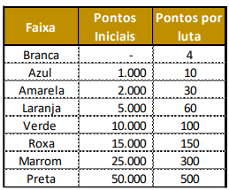

# NoGard

NoGard ou No Gard é uma arte marcial nórdica e um esporte de combate. Há indícios que 
tenha surgido na região hoje conhecida com Noruega aproximadamente no ano 200 d.C., hoje 
o NoGard é disputado praticamente em todo território nórdico e em alguns outros países.
A categoria é classificada em 8 (oito) faixas que identificam a evolução e a aptidão do atleta, 
sendo que quando um atleta muda de faixa, obrigatoriamente ele passa para a faixa seguinte, 
não pode pular uma cor de faixa. 
Quando o atleta muda de faixa os pontos anteriores são desprezados e ele assume os pontos 
iniciais daquela faixa. A cada vitória com aquela faixa ele ganha os “pontos por luta” relativos 
aquela faixa conforme tabela abaixo. A cada derrota com aquela faixa ele perde 50% dos 
“pontos por luta” relativos aquela faixa. Quando uma luta termina empatada, os dois atletas 
ganham 2 pontos.

Faça um programa para auxiliar a Federação Internacional de NoGard a calcular e analisar a 
performance dos atletas, sendo:
1. Receba o nome do atleta, a faixa que ele conquistou, a quantidade de vitórias, 
empates e derrotas com aquela faixa.
2. Para cada atleta, exiba as 3(três) linhas abaixo separadas por uma linha em branco, 
sem apagar as linhas anteriores
XXXXXXX da faixa YYYYYYY tem 99999 pontos, sendo xx,x% dos pontos iniciais da faixa e yy,y% em pontos conquistados em lutas
Total de lutas: 999 sendo zz,z% vitórias e kk,k% derrotas ou empates
Se XXXXXXXX tivesse vitória em todas as lutas ele teria 99999 pontos, hoje ele tem ww,w% do total
XXXXXXX da faixa YYYYYYY tem 99999 pontos, sendo xx,x% dos pontos iniciais da faixa e yy,y% em pontos conquistados em lutas
Total de lutas: 999 sendo zz,z% vitórias e kk,k% derrotas ou empates
Se XXXXXXXX tivesse vitória em todas as lutas ele teria 99999 pontos, hoje ele tem ww,w% do tota